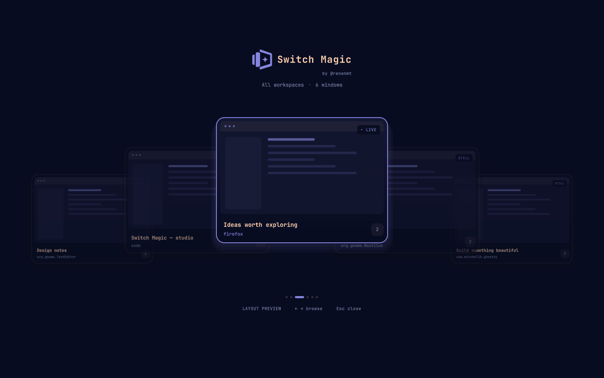
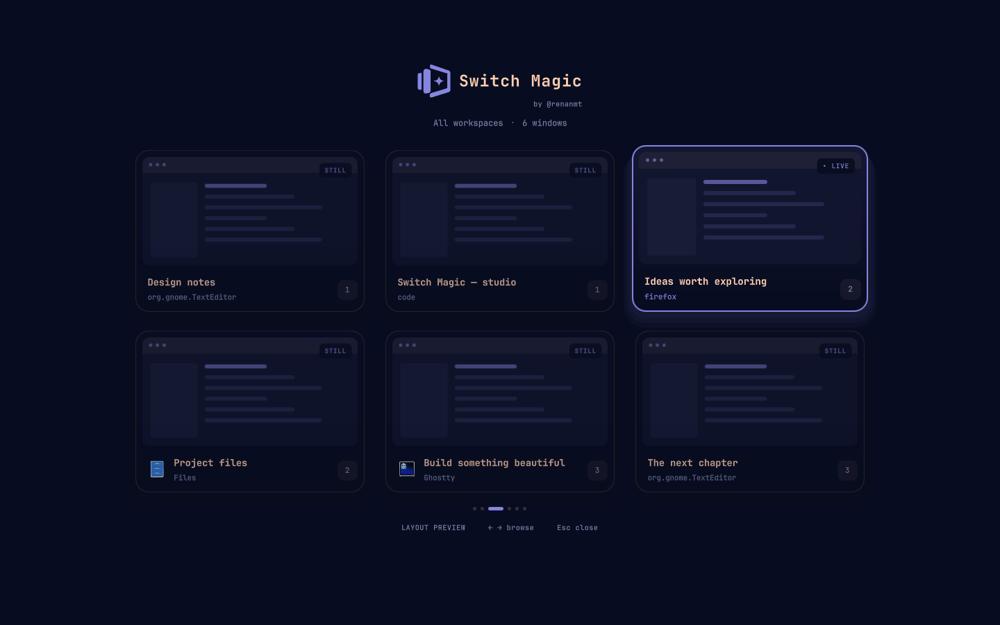
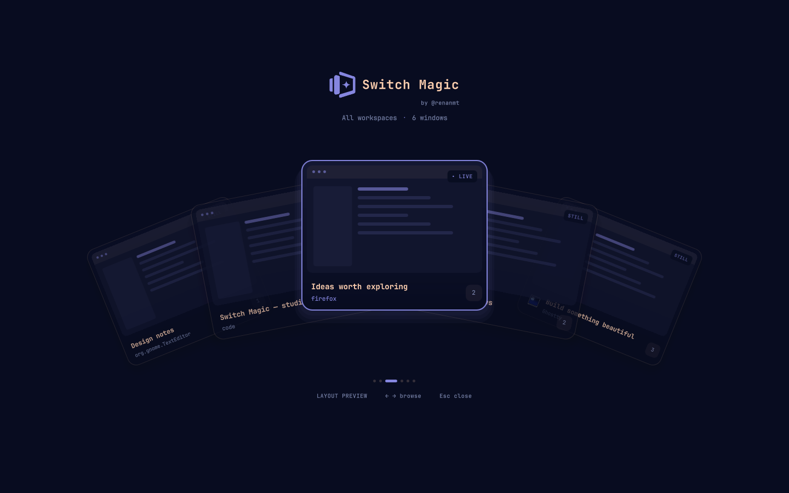
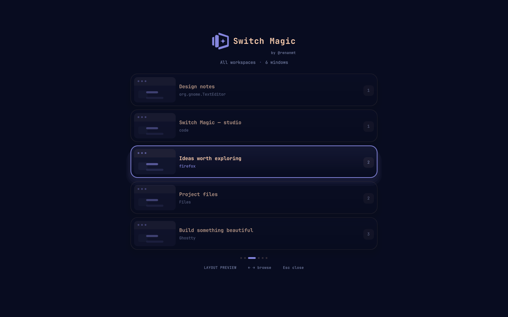
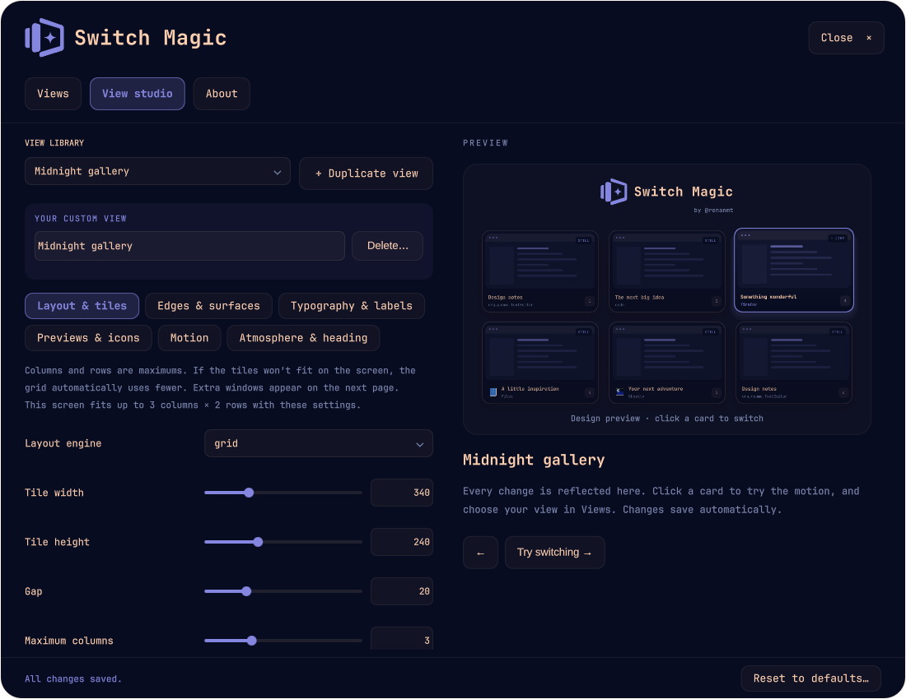

<div align="center">
  <picture>
    <source media="(prefers-color-scheme: dark)" srcset="docs/images/logo-dark.svg">
    
  </picture>
  <p><strong>A little magic between windows.</strong></p>
  <p>A visual workspace and window switcher for Omarchy.<br>Browse a space or window, then release to switch.</p>
  <p>
    
    
    <a href="LICENSE"></a>
  </p>
  <p><a href="#quick-start">Quick start</a> · <a href="#four-ways-to-find-your-window">Layouts</a> · <a href="#make-it-yours">View studio</a> · <a href="docs/CONFIGURATION.md">Configuration</a></p>
</div>



<p align="center"><sub>Actual app interface with fictional window content. Your colors and fonts follow your Omarchy theme.</sub></p>

## Meet your new Alt+Tab

Switch Magic keeps your windows in sight while you hold **Alt**, including above fullscreen apps. Browse the previews, release Alt, and the selected window takes focus.

- **Four scopes.** Switch windows on the current workspace or monitor, browse every window, or open a workspace-first overview.
- **Four built-in views.** List, Grid, Carousel, and Hand of cards.
- **Your own style.** Duplicate a view and tune its geometry, typography, borders, shadows, and motion.
- **Your choice of previews.** Live windows, snapshots, icons, or live capture for the selected card only.
- **Made for your theme.** Omarchy colors and fonts, with optional per-view overrides.
- **Automatic saving.** Every valid change saves as you go. No Apply button, no extra step.

## Quick start

**Requires:** Omarchy 4 with its Quickshell shell, Hyprland 0.56+ with Lua configuration, Quickshell with `ScreencopyView`, and Python 3. This is an Omarchy shell plugin; it uses Omarchy's theme and plugin services.

Install with Omarchy's plugin manager:

```sh
omarchy plugin add https://github.com/renanmt/switch-magic --enable
```

Hold **Alt** and press **Tab**. Shortcuts attach automatically when the plugin is enabled. No setup script or configuration edits are required.

Update with `omarchy plugin update renanmt.switch-magic`.

Open preferences with **F2** while the switcher is visible, or directly:

```sh
omarchy-shell switch-magic settings
```

<details>
<summary><strong>How automatic shortcuts work</strong></summary>

While enabled, Switch Magic registers its four shortcuts in Hyprland's running configuration. Disabling or removing the plugin reloads your saved Hyprland configuration, restoring Omarchy's defaults or your saved custom bindings. A watchdog also restores them if the shell stops unexpectedly (within about eight seconds).

New installations never edit your Hyprland configuration files. Upgrading from the old installer automatically backs up and removes its exact marked include from `~/.config/hypr/bindings.lua`. Backups are stored in `~/.config/switch-magic/backups/`. A manually modified legacy block is left untouched and reported in preferences.

</details>

## One gesture, four scopes

| Shortcut | Windows to browse | Default view | Default previews |
| :--- | :--- | :--- | :--- |
| **Alt + Tab** | Workspaces on the focused monitor | Grid | Live selection |
| **Shift + Alt + Tab** | Every workspace on the focused monitor | Hand of cards | Snapshot |
| **Ctrl + Alt + Tab** | Every workspace on every monitor | Grid | Live selection |
| **Ctrl + Super + Tab** | Current workspace windows | Carousel | Live |

Choose a different view and preview mode for each shortcut independently.

The workspace overview shows one card per workspace, with small previews of its windows. Use the arrow keys to choose a space, then release Alt or press Enter to switch to it. The overview lists workspaces reported by Hyprland on the focused monitor, including empty workspaces.

| While the switcher is open | Action |
| :--- | :--- |
| Keep holding the shortcut modifiers | Keep the switcher visible |
| Press **Tab** again | Browse the next space or window |
| **← / →** | Move backward or forward |
| **↑ / ↓** | Move between grid rows |
| Release **Alt** / **Ctrl+Super**, press **Enter**, or click a card | Switch to the selected space or focus the selected window |
| **Esc** | Cancel without switching |
| **F2** | Open preferences |

**Shift + Alt + Tab selects the monitor scope**; use the arrow keys to browse backward. Opening preferences keeps them visible after you release Alt.

## Four ways to find your window

The carousel above puts the selected window front and center. Prefer a gallery, a fan, or a compact list? Pick the view that suits your workflow.

<table>
  <tr>
    <td width="50%"><br><strong>Grid</strong><br>A window gallery with configurable maximum rows and columns. It automatically fits the screen.</td>
    <td width="50%"><br><strong>Hand of cards</strong><br>A spread of tilted previews, with adjustable spacing, depth, and rotation.</td>
  </tr>
</table>

<details>
<summary><strong>Prefer something compact? See List.</strong></summary>



A focused, vertical list with small previews and room for window titles. List and Grid page through windows when they cannot all fit at once.

</details>

## Make it yours

### A different view for every shortcut

Choose a scope, browse your view library, and pick a preview mode. The carousel shows navigation arrows only when more views are available.


### Your view, down to the details

Open **View studio**, choose a template, select **Duplicate view**, and give your creation a name. Adjust the controls and try the motion in the interactive preview.



| Make it feel right | What you can change |
| :--- | :--- |
| **Layout & tiles** | Layout engine, tile dimensions, gaps, grid limits, card spread, angle, and depth |
| **Edges & surfaces** | Corner radius, border thickness, surface opacity, tint, padding, and shadows |
| **Typography & labels** | Fonts, text sizes, weight, spacing, labels, and workspace badges |
| **Previews & icons** | Capture mode, icon sizes, and preview badges |
| **Motion** | Duration, easing, entrance effects, and individual transition toggles |
| **Atmosphere & heading** | Theme or custom accent, backdrop dimming, logo sizing, and hints |

Everything saves automatically. Built-in views remain read-only, so you always have a starting point. New installations include **only the four defaults**; your named views live in your own settings. The custom view shown here is a demonstration.

In **Shortcuts**, toggle **Picker branding** to show or hide the Switch Magic logo and wordmark.

Custom views can be renamed or deleted with confirmation. Deleting an assigned view returns its shortcuts to the corresponding built-in template.

### Pick how much to preview

| Mode | What you see |
| :--- | :--- |
| **Live** | Live captures of visible window cards |
| **Snapshot** | A still captured when a card becomes visible |
| **Live selection** | A live selected card, with still previews for the others |
| **Icons only** | Application icons without window capture |
| **View default** | The preview mode defined by the selected view |

Captures stay in memory; the plugin does not write window screenshots to disk. Hidden, suspended, protected, or unavailable windows may show a stale image or an icon fallback. Live previews update when the application and compositor supply frames.

## Prefer JSON?

Views are declarative objects, with separate sections for geometry, card styling, previews, animation, and the surrounding scene. The same field catalogue drives the editor and its validation.

```sh
# Use the fan for the current-workspace shortcut.
omarchy-shell switch-magic configure '{"profiles":{"workspace":{"view":"fan"}}}'

# Inspect your current configuration.
omarchy-shell switch-magic configuration
```

Read the [configuration guide](docs/CONFIGURATION.md), explore the [built-in definitions](defaults.json), or use the [JSON schema](settings.schema.json). User settings live in the plugin entry in `~/.config/omarchy/shell.json`.

## Development

QML interface, JavaScript layout logic, and a small Lua bridge for Alt-release handling. No downloaded JavaScript dependencies.

```sh
python scripts/check.py
```

See the [development guide](docs/DEVELOPMENT.md) for isolated previews, project structure, and schema generation. The [validation notes](docs/VALIDATION.md) describe the environments and behavior checked so far.

## Uninstall

```sh
omarchy plugin remove renanmt.switch-magic
```

Your saved keyboard shortcuts return automatically. To temporarily turn Switch Magic off, use `omarchy plugin disable renanmt.switch-magic`.

---

<p align="center">Designed and created by <strong>Renan Tonheiro</strong> · <strong>@renanmt</strong><br><a href="LICENSE">MIT licensed</a> · Made for Omarchy</p>
